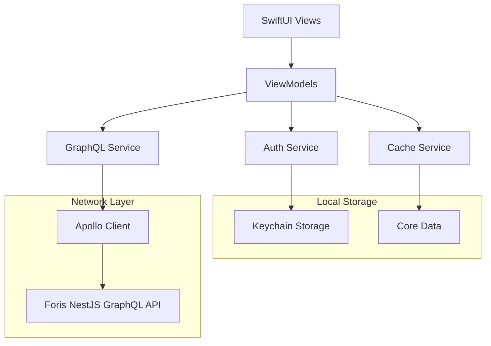

# Design Document

## Overview

This design outlines the comprehensive update of the Foris iOS app to integrate with the NestJS GraphQL API backend. The current app has basic networking infrastructure but only implements a simple "Hello World" feature. The new design will transform Foris into a full-featured social fitness platform with authentication, user profiles, posts, comments, likes, challenges, leagues, and user following functionality.

The Foris app architecture will follow MVVM pattern with SwiftUI, implement GraphQL integration using Apollo iOS, provide secure authentication with OAuth providers, and include offline capabilities with Core Data for local caching.

## Architecture

### High-Level Architecture



### Layer Responsibilities

1. **UI Layer (SwiftUI Views)**
   - User interface components
   - Navigation and routing
   - User input handling
   - State presentation

2. **Presentation Layer (ViewModels)**
   - Business logic coordination
   - State management
   - Data transformation
   - Error handling

3. **Service Layer**
   - GraphQL operations
   - Authentication management
   - Caching strategies
   - Network monitoring

4. **Data Layer**
   - Local persistence (Core Data)
   - Secure storage (Keychain)
   - Remote data (GraphQL API)

## Components and Interfaces

### Authentication System

#### AuthService
```swift
protocol AuthServiceProtocol {
    var isAuthenticated: Bool { get }
    var currentUser: User? { get }
    
    func signIn(with provider: OAuthProvider) async throws -> AuthResult
    func signOut() async throws
    func refreshTokens() async throws -> AuthResult
    func getCurrentUser() async throws -> User
}
```

#### OAuth Integration
- **Google Sign-In**: Using GoogleSignIn SDK
- **Apple Sign-In**: Using AuthenticationServices framework
- **Token Management**: Secure storage in Keychain with automatic refresh

### GraphQL Integration

#### GraphQLService
```swift
protocol GraphQLServiceProtocol {
    func fetch<Query: GraphQLQuery>(_ query: Query) async throws -> Query.Data
    func perform<Mutation: GraphQLMutation>(_ mutation: Mutation) async throws -> Mutation.Data
    func subscribe<Subscription: GraphQLSubscription>(_ subscription: Subscription) -> AsyncThrowingStream<Subscription.Data, Error>
}
```

#### Apollo Client Configuration
- **Network Transport**: HTTP with authentication headers
- **Caching**: Normalized cache with Core Data backing
- **Error Handling**: Custom error interceptors
- **Retry Logic**: Exponential backoff for failed requests

### Data Models

#### Core Entities
```swift
// User model matching GraphQL schema
struct User: Codable, Identifiable {
    let id: String
    let name: String
    let email: String
    let bio: String?
    let avatarUrl: String?
    let followerCount: Int
    let followingCount: Int
}

// Post model with relationships
struct Post: Codable, Identifiable {
    let id: String
    let title: String
    let content: String?
    let authorId: String
    let author: User
    let createdAt: Date
    let likeCount: Int
    let commentCount: Int
    let isLiked: Bool
}

// Challenge model with status tracking
struct Challenge: Codable, Identifiable {
    let id: String
    let name: String
    let description: String?
    let createdBy: String
    let endDate: Date?
    let userStatus: ChallengeStatus?
}
```

### UI Components Architecture

#### Navigation Structure
```
TabView
├── FeedTab
│   ├── FeedView (Posts list)
│   ├── PostDetailView
│   └── CreatePostView
├── ChallengesTab
│   ├── ChallengesListView
│   ├── ChallengeDetailView
│   └── CreateChallengeView
├── LeaguesTab
│   ├── LeaguesListView
│   ├── LeagueDetailView
│   └── CreateLeagueView
├── SocialTab
│   ├── UsersListView
│   ├── UserProfileView
│   └── FollowersListView
└── ProfileTab
    ├── ProfileView
    ├── EditProfileView
    └── SettingsView
```

#### Reusable Components
- **PostCard**: Displays post with like/comment actions
- **UserCard**: Shows user info with follow button
- **ChallengeCard**: Challenge info with join/status actions
- **LoadingView**: Consistent loading states
- **ErrorView**: Error handling with retry options
- **EmptyStateView**: Empty list states with actions

### State Management

#### ViewModels Structure
```swift
// Base ViewModel with common functionality
class BaseViewModel: ObservableObject {
    @Published var isLoading = false
    @Published var error: AppError?
    
    func handleError(_ error: Error)
    func showLoading()
    func hideLoading()
}

// Feed-specific ViewModel
class FeedViewModel: BaseViewModel {
    @Published var posts: [Post] = []
    @Published var hasMorePosts = true
    
    func loadPosts() async
    func refreshPosts() async
    func loadMorePosts() async
    func likePost(_ postId: String) async
}
```

## Data Models

### GraphQL Schema Integration

The app will use Apollo iOS to generate Swift types from the GraphQL schema. Key generated types include:

#### Queries
- `GetPostsQuery`: Fetch posts with pagination
- `GetUserProfileQuery`: Fetch user profile data
- `GetChallengesQuery`: Fetch available challenges
- `GetLeaguesQuery`: Fetch leagues list

#### Mutations
- `CreatePostMutation`: Create new post
- `LikePostMutation`: Toggle post like
- `FollowUserMutation`: Follow/unfollow user
- `JoinChallengeMutation`: Join challenge
- `UpdateProfileMutation`: Update user profile

#### Subscriptions
- `PostUpdatesSubscription`: Real-time post updates
- `ChallengeUpdatesSubscription`: Challenge status changes

### Local Data Models

#### Core Data Entities
```swift
// Cached user data
@objc(CachedUser)
class CachedUser: NSManagedObject {
    @NSManaged var id: String
    @NSManaged var name: String
    @NSManaged var email: String
    @NSManaged var bio: String?
    @NSManaged var avatarUrl: String?
    @NSManaged var lastUpdated: Date
}

// Cached posts for offline viewing
@objc(CachedPost)
class CachedPost: NSManagedObject {
    @NSManaged var id: String
    @NSManaged var title: String
    @NSManaged var content: String?
    @NSManaged var authorId: String
    @NSManaged var createdAt: Date
    @NSManaged var isLiked: Bool
    @NSManaged var likeCount: Int32
    @NSManaged var lastUpdated: Date
}
```

## Error Handling

### Error Types
```swift
enum AppError: Error, LocalizedError {
    case authentication(AuthError)
    case network(NetworkError)
    case graphql(GraphQLError)
    case validation(ValidationError)
    case storage(StorageError)
    
    var errorDescription: String? {
        // User-friendly error messages
    }
    
    var recoverySuggestion: String? {
        // Actionable recovery suggestions
    }
}
```

### Error Handling Strategy
1. **Network Errors**: Automatic retry with exponential backoff
2. **Authentication Errors**: Automatic token refresh, fallback to re-login
3. **GraphQL Errors**: Parse and display specific field errors
4. **Validation Errors**: Real-time form validation with inline messages
5. **Storage Errors**: Graceful degradation with user notification

## Testing Strategy

### Unit Testing
- **ViewModels**: Test business logic and state management
- **Services**: Mock dependencies and test API interactions
- **Models**: Test data transformation and validation
- **Utilities**: Test helper functions and extensions

### Integration Testing
- **GraphQL Operations**: Test queries/mutations against mock server
- **Authentication Flow**: Test OAuth integration with mock providers
- **Core Data**: Test data persistence and migration
- **Network Layer**: Test Apollo client configuration

### UI Testing
- **Navigation**: Test tab switching and screen transitions
- **User Interactions**: Test button taps, form submissions, pull-to-refresh
- **Accessibility**: Test VoiceOver navigation and announcements
- **Error States**: Test error handling and recovery flows

### Testing Tools
- **XCTest**: Native testing framework
- **Apollo iOS Testing**: GraphQL operation testing utilities
- **Combine Testing**: Async operation testing
- **SwiftUI Testing**: UI component testing

### Mock Strategy
```swift
// Mock GraphQL service for testing
class MockGraphQLService: GraphQLServiceProtocol {
    var mockResponses: [String: Any] = [:]
    var shouldFail = false
    
    func fetch<Query: GraphQLQuery>(_ query: Query) async throws -> Query.Data {
        if shouldFail {
            throw AppError.network(.serverError(500))
        }
        // Return mock data based on query type
    }
}

// Mock authentication service
class MockAuthService: AuthServiceProtocol {
    var mockUser: User?
    var isAuthenticated: Bool { mockUser != nil }
    
    func signIn(with provider: OAuthProvider) async throws -> AuthResult {
        // Return mock authentication result
    }
}
```

### Test Data Management
- **GraphQL Mocks**: JSON fixtures for different query responses
- **User Scenarios**: Predefined user states for testing flows
- **Error Scenarios**: Mock error conditions for error handling tests
- **Performance Testing**: Load testing with large datasets

## Implementation Phases

### Phase 1: Foundation (Authentication & Core Infrastructure)
- Apollo iOS integration
- Authentication system with OAuth
- Core Data setup
- Base ViewModels and Services
- Navigation structure

### Phase 2: Core Features (Posts & Users)
- User profiles and editing
- Posts creation and viewing
- Comments system
- Like functionality
- User following

### Phase 3: Social Features (Challenges & Leagues)
- Challenges listing and joining
- Challenge status tracking
- Leagues creation and management
- League challenges integration

### Phase 4: Polish & Optimization
- Offline capabilities
- Performance optimization
- Accessibility improvements
- Error handling refinement
- UI/UX polish